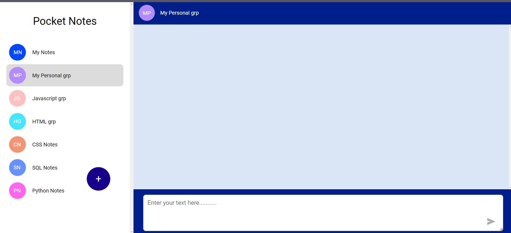
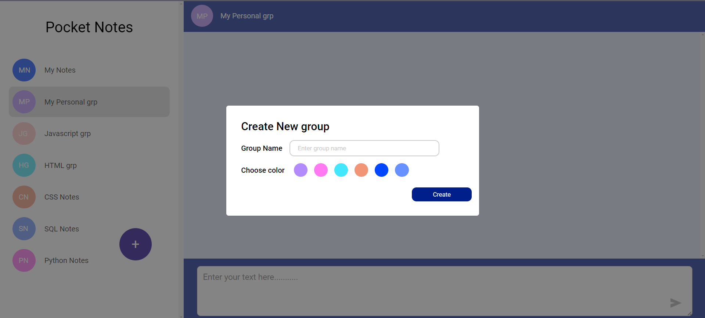

# 📝 Pocket Notes

Pocket Notes is a simple and intuitive note-taking application that allows users to organize their notes into groups. The application is fully optimized for mobile view, ensuring a smooth experience on any device.

## ✨ Features

- 🗂️ **Group Management**: Create and organize notes into different groups.
- 🎯 **Smooth Scrolling**: A scrollbar in the sidebar for easy navigation through groups and notes.
- 📱 **Mobile Optimization**: The app is fully optimized for mobile view, ensuring both the group section and note section are mobile-friendly.

## 🛠️ Tech Stack

- **Frontend**: React.js
- **Styling**: CSS, Tailwind CSS

## ⚙️ Getting Started

### Prerequisites

Ensure you have the following installed on your local development environment:

- **Node.js** (v14 or later)
- **npm** (v6 or later)

### 📥 Installation

1. **Clone the repository**:

    ```bash
    git clone https://github.com/your-username/pocket-notes.git
    ```

2. **Navigate to the project directory**:

    ```bash
    cd pocket-notes
    ```

3. **Install the dependencies**:

    ```bash
    npm install
    ```

## 🚀 Running the Application

1. **Start the development server**:

    ```bash
    npm start
    ```

2. Open your browser and navigate to `http://localhost:3000` to view the application.

## 💡 Usage

- 🖋️ **Creating a Group**: Enter a name and select a color for the group.
- 📄 **Adding Notes**: Click on a group to add notes to it.
- 🧭 **Navigating**: Use the scrollbar in the sidebar to navigate through different groups and notes.

## 📸 Screenshots





## 📜 License

This project is licensed under the MIT License. See the [LICENSE](LICENSE) file for details.
